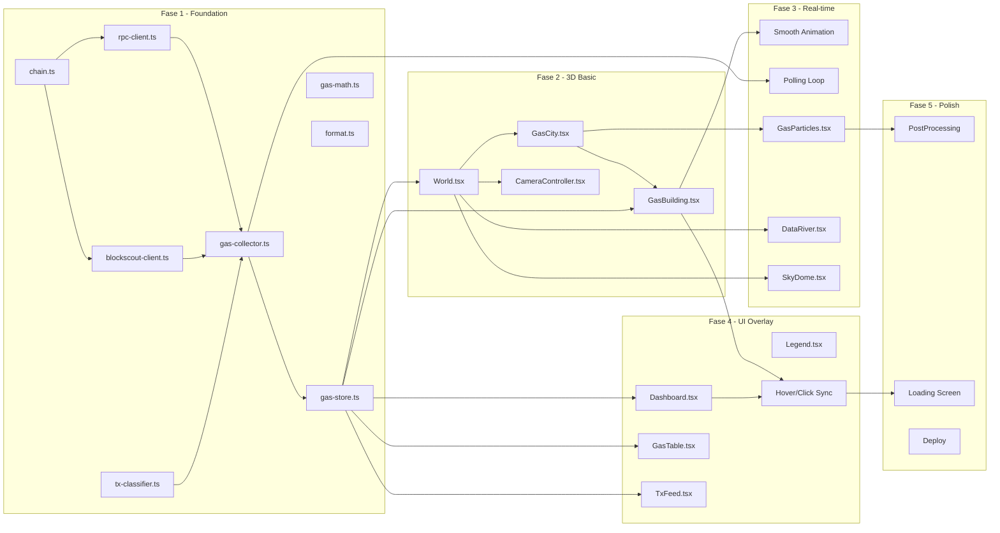

# Alur Kerja Implementasi — GasHood

Dokumen ini berisi alur kerja detail per fase, checklist, dependency graph, dan kriteria selesai untuk setiap tahap.

---

## Timeline Overview

```
Minggu 1        Minggu 2        Minggu 3        Minggu 4        Minggu 5
━━━━━━━━        ━━━━━━━━        ━━━━━━━━        ━━━━━━━━        ━━━━━━━━
Foundation      3D Basic        Real-time       UI Overlay      Polish
┣━ Setup        ┣━ Scene        ┣━ Polling      ┣━ Dashboard    ┣━ PostFX
┣━ RPC Client   ┣━ Buildings    ┣━ Particles    ┣━ Table        ┣━ Sound
┣━ Blockscout   ┣━ Camera       ┣━ River        ┣━ Feed         ┣━ Loading
┣━ Classifier   ┣━ Connect      ┣━ Sky          ┣━ Legend       ┣━ Errors
┣━ Collector    ┃  Store→3D     ┣━ Animation    ┣━ Interaction  ┣━ README
┗━ Store        ┃               ┗━ Optimize     ┗━ Responsive   ┗━ Deploy
```

---

## Dependency Graph



---

## Fase 1 — Foundation (Minggu 1)

### Tujuan
Setup proyek, koneksi ke blockchain, klasifikasi transaksi, dan state management.

### Checklist

#### 1.1 Project Setup
- [ ] Init proyek: `npm create vite@latest gashood -- --template react-ts`
- [ ] Install dependencies:
  ```bash
  npm install three @react-three/fiber @react-three/drei @react-three/postprocessing
  npm install zustand viem
  npm install tailwindcss @tailwindcss/vite
  npm install -D @types/three vitest
  ```
- [ ] Konfigurasi `vite.config.ts`
- [ ] Konfigurasi `tsconfig.json` (strict mode, path aliases)
- [ ] Konfigurasi Tailwind CSS v4
- [ ] Buat `.env.local` dengan environment variables
- [ ] Buat `.gitignore`

#### 1.2 Chain Configuration
- [ ] Buat `src/config/chain.ts`
  - Chain ID, RPC URL, explorer URL
  - Type definitions untuk chain config
- [ ] Verifikasi: import dan log config, pastikan values benar

#### 1.3 RPC Client
- [ ] Buat `src/data/rpc-client.ts`
  - `createRpcClient()` — init viem public client
  - `getLatestBlock()` — fetch block terbaru + txs
  - `getTransactionReceipt(hash)` — fetch single receipt
  - `batchGetReceipts(hashes[])` — batch fetch (max 20)
  - `getGasPrice()` — current L2 gas price
- [ ] **Test:** `rpc-client.test.ts`
  - Koneksi ke Robinhood RPC berhasil
  - Bisa ambil block terbaru
  - Receipt mengandung gasUsed dan effectiveGasPrice

#### 1.4 Blockscout Client
- [ ] Buat `src/data/blockscout-client.ts`
  - `getStats()` — network statistics
  - `getRecentTransactions(limit)` — list tx terbaru
  - `getTransactionSummary(hash)` — human-readable summary
- [ ] **Test:** `blockscout-client.test.ts`
  - Fetch stats berhasil
  - Response shape sesuai type definition

#### 1.5 Transaction Classifier
- [ ] Buat `src/data/tx-classifier.ts`
  - `TxType` enum (12 tipe)
  - `METHOD_SIGNATURES` map (4-byte → tipe)
  - `classifyTransaction(tx)` → TxType
  - Handle edge case: transferFrom (ERC-20 vs ERC-721)
- [ ] **Test:** `tx-classifier.test.ts`
  - Native transfer (empty calldata)
  - ERC-20 transfer (0xa9059cbb)
  - Contract deploy (to = null)
  - DEX swap (0x38ed1739)
  - Unknown method → CONTRACT_CALL

#### 1.6 Gas Collector
- [ ] Buat `src/data/gas-collector.ts`
  - `startCollecting(interval)` — mulai polling loop
  - `stopCollecting()` — hentikan
  - `processBlock(block)` — extract + classify + calculate
  - Error handling: retry, adaptive interval
- [ ] **Test:** `gas-collector.test.ts`
  - Proses satu block → output array ClassifiedTransaction
  - Error handling tidak crash

#### 1.7 Zustand Store
- [ ] Buat `src/store/gas-store.ts`
  - `GasMetric` interface
  - `GasStore` interface
  - `useGasStore` hook
  - Actions: updateMetrics, selectType, hoverType
  - Computed: gasMetricsArray (sorted), networkHealth
- [ ] **Test:** `gas-store.test.ts`
  - Update metrics mengubah state
  - Ring buffer recentTxs max 200

#### 1.8 Utility Functions
- [ ] Buat `src/utils/gas-math.ts`
  - `calculateTotalFee(gasUsed, effectiveGasPrice)`
  - `weiToGwei(wei)`, `weiToEth(wei)`, `gweiToEth(gwei)`
- [ ] Buat `src/utils/format.ts`
  - `formatGasPrice(gwei)` — "0.05 Gwei"
  - `formatEth(eth)` — "0.000018 ETH"
  - `formatTxHash(hash)` — "0xab..cd"
  - `formatNumber(n)` — "180,000"
- [ ] **Test:** unit tests untuk semua format functions

### Kriteria Selesai Fase 1
- ✅ `npm run dev` berjalan tanpa error
- ✅ Console log menampilkan block terbaru dari Robinhood RPC
- ✅ Transaksi terklasifikasi dengan benar (cek 10 tx manual)
- ✅ Zustand store terupdate setiap polling cycle
- ✅ Semua unit test pass

---

## Fase 2 — 3D World Basic (Minggu 2)

### Tujuan
Scene 3D dasar dengan bangunan statis yang terhubung ke Zustand store.

### Checklist

#### 2.1 Canvas Setup
- [ ] Buat `src/App.tsx`
  - `<Canvas>` dari R3F dengan config:
    - `camera={{ position: [15, 12, 15], fov: 50 }}`
    - `dpr={[1, 2]}` — adaptive pixel ratio
    - `shadows`
  - Layout: Canvas full screen + UI overlay di atas
- [ ] Verifikasi: browser menampilkan canvas kosong

#### 2.2 World Scene
- [ ] Buat `src/scene/World.tsx`
  - Ambient light (intensity 0.4)
  - Directional light (intensity 0.8, position [10, 15, 5])
  - Ground plane: `<mesh rotation={[-π/2, 0, 0]}>`
    - `PlaneGeometry(30, 30)`
    - `MeshStandardMaterial` dengan grid texture/warna gelap
  - Fog: `<fog attach="fog" args={['#0a0a0f', 20, 50]} />`
  - Environment: `<Environment preset="city" />`
- [ ] Verifikasi: scene gelap dengan ground plane dan lighting

#### 2.3 Gas City Layout
- [ ] Buat `src/scene/GasCity.tsx`
  - Layout grid 4×3 dengan spacing
  - Posisi bangunan computed dari index
  - Map dari TxType → posisi grid
  - Render 12 `<GasBuilding>` children
- [ ] Verifikasi: 12 box muncul di grid

#### 2.4 Gas Building
- [ ] Buat `src/scene/GasBuilding.tsx`
  - Props: `txType`, `position`
  - Subscribe ke Zustand store untuk metric tipe ini
  - BoxGeometry dengan height dari avgGasUsed
  - Color dari gas price bracket
  - Floating `<Text>` label di atas bangunan
  - Hover handler: `onPointerOver/Out`
  - Click handler: `onClick`
- [ ] Verifikasi: bangunan muncul dengan warna dan label

#### 2.5 Camera Controller
- [ ] Buat `src/scene/CameraController.tsx`
  - `<OrbitControls>` dari drei
  - `autoRotate` saat idle (speed 0.3)
  - `enableDamping` untuk smooth
  - Min/max distance (5 — 40)
  - Max polar angle (π/2.5 — tidak bisa lihat dari bawah)
- [ ] Verifikasi: bisa orbit, zoom, pan

#### 2.6 Connect Store → 3D
- [ ] Wire up gas-collector → store → buildings
  - Mulai polling saat App mount
  - Buildings auto-update height & color
- [ ] Verifikasi: bangunan berubah saat data baru masuk

### Kriteria Selesai Fase 2
- ✅ 12 bangunan tampil di grid dengan label
- ✅ Bangunan mempunyai warna sesuai gas price
- ✅ Kamera bisa di-orbit, zoom, pan
- ✅ Data dari RPC mengubah tinggi bangunan
- ✅ Tidak ada console error

---

## Fase 3 — Real-time Data Flow (Minggu 3)

### Tujuan
Animasi live, efek partikel, sungai data, dan langit dinamis.

### Checklist

#### 3.1 Smooth Building Animation
- [ ] Implementasi lerp di `GasBuilding.tsx`
  - Height lerp (speed 0.05)
  - Color lerp (speed 0.03)
  - Pulse effect saat tx baru (scale 1.05, decay 0.5s)
- [ ] Verifikasi: transisi bangunan smooth, bukan jump

#### 3.2 Polling Loop Refinement
- [ ] Implementasi adaptive polling di `gas-collector.ts`
  - Base: 3 detik
  - Rate limited: backoff ke 10 detik
  - Recovery: turun 500ms per sukses
  - Track block number — skip jika block sama
- [ ] Verifikasi: tidak ada duplicate processing

#### 3.3 Gas Particles
- [ ] Buat `src/scene/GasParticles.tsx`
  - InstancedMesh (max 500 instances)
  - Listen to store: saat tx baru masuk, spawn partikel
  - Per-partikel: position, velocity, life, size, color
  - useFrame loop: update posisi, fade out, recycle
  - Color per TxType (lihat 3D_DESIGN.md)
- [ ] Verifikasi: partikel muncul dari bangunan saat ada tx baru

#### 3.4 Data River
- [ ] Buat `src/scene/DataRiver.tsx`
  - Plane geometry di tengah layout
  - Custom ShaderMaterial:
    - Scrolling noise pattern
    - Speed dari TPS
    - Color dari gas price
    - Glow effect
  - Subscribe ke store untuk speed & color
- [ ] Verifikasi: sungai mengalir, kecepatan berubah

#### 3.5 Sky Dome
- [ ] Buat `src/scene/SkyDome.tsx`
  - SphereGeometry hemisphere
  - Gradient shader:
    - 4 state: rendah/sedang/tinggi/sangat tinggi
    - Lerp antar state berdasar network utilization
  - Cloud layer (opsional, bisa pakai sprite)
- [ ] Verifikasi: langit berubah warna saat gas price berubah

#### 3.6 Performance Optimization
- [ ] Profile dengan Chrome DevTools Performance tab
  - Target: 60 FPS stabil
  - Identify bottleneck (draw calls, state updates)
- [ ] Optimasi jika perlu:
  - `useMemo` untuk geometry/material yang statis
  - `React.memo` untuk komponen yang jarang berubah
  - Reduce max particles jika FPS drop
  - `frameloop="demand"` jika perlu
- [ ] Verifikasi: DevTools menunjukkan 60 FPS

### Kriteria Selesai Fase 3
- ✅ Bangunan beranimasi smooth
- ✅ Partikel muncul saat transaksi baru
- ✅ Sungai data mengalir
- ✅ Langit berubah warna
- ✅ Stabil 60 FPS
- ✅ Tidak ada memory leak (cek heap snapshot)

---

## Fase 4 — UI Overlay (Minggu 4)

### Tujuan
Dashboard 2D overlay di atas canvas 3D, interaksi bi-directional.

### Checklist

#### 4.1 Dashboard Stats
- [ ] Buat `src/ui/Dashboard.tsx`
  - Layout: fixed top bar atau floating cards
  - Isi:
    - ⛽ Current Gas Price: X Gwei
    - 📊 TPS: X tx/s
    - 📦 Block: #XXXXXX
    - 💰 Avg Fee: X ETH
  - Subscribe ke store, update real-time
  - Styling: semi-transparent background, blur
- [ ] Verifikasi: stats tampil dan update

#### 4.2 Gas Fee Table
- [ ] Buat `src/ui/GasTable.tsx`
  - Tabel 12 baris (semua tipe)
  - Kolom: Type | Avg Gas | Avg Price | Count | Total Fee
  - Sortable by kolom
  - Row hover → highlight bangunan 3D (via store)
  - Row click → select type → camera focus
  - Color dot per tipe (match partikel color)
- [ ] Verifikasi: tabel sortable, hover sync dengan 3D

#### 4.3 Transaction Feed
- [ ] Buat `src/ui/TxFeed.tsx`
  - Scrollable vertical list
  - Per item: hash (link), tipe badge, gas used, fee
  - Auto-scroll ke atas saat data baru
  - Max 50 item visible (virtualized jika perlu)
  - Link ke Blockscout: `https://robinhoodchain.blockscout.com/tx/{hash}`
- [ ] Verifikasi: feed scroll lancar, link berfungsi

#### 4.4 Legend
- [ ] Buat `src/ui/Legend.tsx`
  - Color scale gas price (gradient bar)
  - Warna per tipe (dots + label)
  - Arti ukuran partikel
  - Collapsible/toggle
- [ ] Verifikasi: legenda tampil, bisa collapse

#### 4.5 Bidirectional Interaction
- [ ] Hover bangunan 3D → highlight row di GasTable
- [ ] Hover row di GasTable → glow bangunan 3D
- [ ] Klik bangunan → buka detail panel + focus camera
- [ ] Klik row → sama seperti klik bangunan
- [ ] Verifikasi: semua interaksi bi-directional bekerja

#### 4.6 Responsive Layout
- [ ] Desktop: 3D full + side panel kanan
- [ ] Tablet: 3D full + bottom sheet
- [ ] Mobile: 3D simplified + toggle overlay
- [ ] Verifikasi: layout benar di 3 breakpoint

### Kriteria Selesai Fase 4
- ✅ Dashboard stats update real-time
- ✅ Tabel sortable dan sync dengan 3D
- ✅ Feed scrollable dengan link ke explorer
- ✅ Interaksi 3D↔2D bi-directional
- ✅ Responsive di desktop, tablet, mobile

---

## Fase 5 — Polish & Deploy (Minggu 5)

### Tujuan
Visual polish, error handling, dokumentasi, dan deployment.

### Checklist

#### 5.1 Post-Processing
- [ ] Tambah `<EffectComposer>` di World.tsx
  - Bloom (threshold 0.8, intensity 0.5)
  - Vignette (offset 0.3, darkness 0.5)
  - SSAO jika performa cukup
- [ ] Tone mapping: ACESFilmic
- [ ] Verifikasi: visual lebih cinematic, FPS tetap 60

#### 5.2 Loading Screen
- [ ] Buat loading screen dengan `useProgress` dari drei
  - Progress bar
  - Logo GasHood
  - "Connecting to Robinhood Chain..."
- [ ] Transisi smooth saat loading selesai
- [ ] Verifikasi: loading screen tampil saat pertama buka

#### 5.3 Error Handling UI
- [ ] RPC error → toast notification "Connection issue, retrying..."
- [ ] WebGL not supported → fallback: tabel-only mode
- [ ] No transactions found → "Waiting for new blocks..."
- [ ] Verifikasi: semua error case ditangani gracefully

#### 5.4 Sound Design (Opsional)
- [ ] Ambient background hum (volume dari network activity)
- [ ] Subtle "ding" per transaksi besar (gas > threshold)
- [ ] Mute toggle di UI
- [ ] Verifikasi: suara tidak mengganggu, bisa di-mute

#### 5.5 README & Documentation
- [ ] Tulis `README.md`:
  - Screenshot/GIF
  - Deskripsi proyek
  - Tech stack
  - Setup instructions
  - Environment variables
  - Contributing guide
- [ ] Review semua docs/ file, update jika ada perubahan
- [ ] Verifikasi: README lengkap dan akurat

#### 5.6 Build & Deploy
- [ ] `npm run build` — pastikan no error
- [ ] Test production build locally: `npm run preview`
- [ ] Deploy ke Vercel:
  ```bash
  npx vercel
  ```
  - Set environment variables di Vercel dashboard
  - Verify production URL
- [ ] Verifikasi: production build berfungsi 100%

### Kriteria Selesai Fase 5
- ✅ Visual polish: bloom, vignette, tone mapping
- ✅ Loading screen berfungsi
- ✅ Error handling graceful
- ✅ README lengkap
- ✅ Production build sukses
- ✅ Deploy live dan berfungsi

---

## Ringkasan Kriteria Sukses Keseluruhan

| # | Kriteria | Metrik |
|---|---|---|
| 1 | Data akurat | Gas fee di app = gas fee di Blockscout (selisih < 1%) |
| 2 | Real-time | Data delay < 10 detik dari block time |
| 3 | Klasifikasi benar | 12 tipe tx teridentifikasi, coverage > 90% |
| 4 | 3D visual | Bangunan, partikel, sungai, langit — semua reaktif |
| 5 | Performa | 60 FPS stabil di mid-range hardware |
| 6 | Interaktif | Hover, klik, navigasi kamera, tabel↔3D sync |
| 7 | Responsif | Berfungsi di desktop, tablet, mobile |
| 8 | Error resilient | Tidak crash saat RPC down / rate limited |
